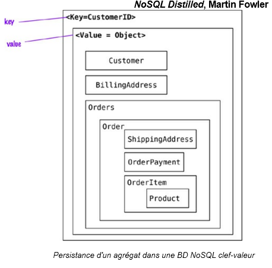
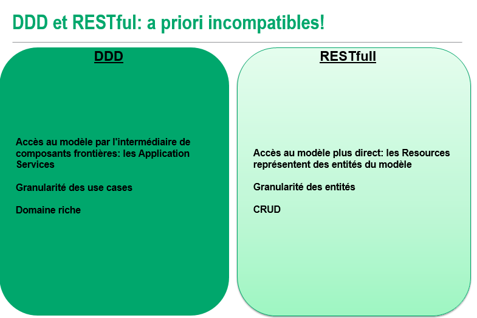

# Domain Driven Design - Architecture

## Architecture hexagonale

## NoSQL (clé/valeur, colonne ou document, pas graphe)

Les BD orientées agrégat n'implémentent les mises à jour atomiques (ACID) que dans un Agrégat.
Les changements dans deux agrégats sont eux soumis à la cohérence éventuelle.

Les BD orientées agrégat permettent toutes de retrouver un Agrégat par l'ID de son Aggregate Root.
L'implémentation du Value Object ID (VOID) est donc cruciale, ces bases étant faites pour être clusterisées.

Le VOID doit donc maintenir sa propriété d'unicité dans un environnement répliqué :
- UUID
- Timestamp+UUID pour lisibilité/requêtabilité

Attention, utiliser une ID générée par la BD NoSQL ne permet pas la stabilité de l'identité!

## Microservice

L'approche DDD est compatible avec une architecture microservices.

Chaque microservice est isolé et autonome, chaque BC est isolé et autonome : Bonne granularité.

Chaque Contexte Borné (Bounded Context) sera déployé dans un microservice.
Cela permet de garantir l'indépendance des BC.

## REST

Cependant, une architecture CQRS est compatible avec RESTful:
- on PUT des commandes
- on GET des queries

Dans le cas d’un modèle non CQRS, utilisation de certaines caractéristiques de REST comme levier pour exposer les cas d’utilisation (exprimées par les Application Services) :
- Routing par URIs
- Mécanismes de représentation (content negotiation : https://en.wikipedia.org/wiki/Content_negotiation)

### Annexe - Résumé de REST

Les ressources sont abstraites : On n’accède pas directement à la ressource mais à travers une représentation.  
De nombreuses représentations sont possibles : text/ html; image/jpeg;application/pdf.  

La requête HTTP spécifie la représentation souhaité via l’entête HTTP (Header HTTP) Accept.  
La réponse HTTP spécifie sa représentation via l’entête HTTP Content-Type.  

Le serveur ne maintient aucun état : Pas d’objet session sur le serveur.  
Facilite la scalabité : Chaque instance du serveur peut traiter la requête entrante (on utilise généralement un load balancer).  
C’est le client qui maintient l’état : Hypermedia.  

#### Hypermedia
Les réponses HTTP contient des liens dont on a besoin : Les changement d’état du client sont fait via ces liens (hypermedia).  
On ne connaît pas au préalable comment interagir avec le serveur.

## Styles d'intégration

### Fichier

Simplicité de mise en oeuvre : oui pour des faibles volumes
Couplage : faible
Fiabilité (sécurité, transaction, concurrence) : faible
Temps de latence : élevé
Scalable : non car difficulté d'exploitation

### BDD Partagée

Simplicité de mise en oeuvre : oui 
Couplage : élevé car nécessité d'un schéma commun
Fiabilité (sécurité, transaction, concurrence) : bonne, transactions 
Temps de latence : souvent élevé
Scalable : non car trop lent

### Remote Procedure Call (RPC)

Simplicité de mise en oeuvre : oui 
Couplage : très élevé 
Fiabilité (sécurité, transaction, concurrence) : bonne 
Temps de latence : faible
Scalable : non car le thread d'envoi peut rester bloqué

### Asynchronous Messaging Style

Simplicité de mise en oeuvre : oui 
Couplage : faible
Fiabilité (sécurité, transaction, concurrence) : perte du contexte de transaction et de sécurité, gestion des erreurs plus complexe  
Temps de latence : envoi rapide (fire and forget)
Scalable : oui car faiblement couplé temporellement, physiquement et logiquement

Pour les styles de communication, voir https://www.youtube.com/watch?v=Xwi1DU6KoQ4 et http://www.enterpriseintegrationpatterns.com/.

## Compatibilité entre versions

