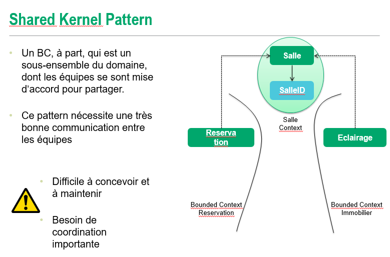
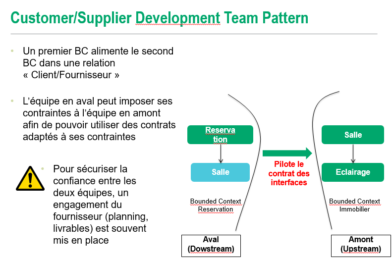

# Domain Driven Design - Design stratégique

## Bounded context

Lié au métier. Parfois plusieurs par application si plusieurs métiers.

## Context mapping

### Communication Upstream / Downstream

Une relation entre deux équipes : L’équipe en amont (upstream) / L’équipe en aval (downstream).

Les actions de l’équipe en amont affecte l’équipe en aval. Mais les actions de l’équipe en aval n’affecte pas les actions de l’équipe en amont.

C’est la métaphore de la rivière : "Si vous êtes en amont et vous polluer la rivière, les personnes en aval vont être impactées. L’inverse n’est pas vrai".

L’enjeu est de donc de spécifier: 
- Comment l'équipe aval va s'adapter à la production de l'équipe amont
- Comment et dans quelle mesure l'équipe amont devra prendre en compte les besoins de l’équipe aval 

## Mapping Patterns

### Shared kernel

- Les deux équipes (en amont et en aval) se sont mise d’accord sur un sous-domaine du modèle à partager
- Ce modèle commun inclus du code, le modèle de données associé avec la partie du modèle en commun
- La modification de ce modèle commun nécessite la consultation et l’accord des deux équipes simultanément
- En terme d’intégration, dès que le shared model est modifié, on doit rejouer les tests sur les deux autres BC

### Customer / Supplier

Le Customer/Supplier Pattern correspond au cas où nous avons partitionner notre système en par exemple deux sous-système avec le principe suivant :
- Le système en amont nourrit le système en aval
- Le second système, le système en aval exploite des fonctionnalités du premier système

Les deux sous-systèmes exploitent généralement des fonctionnalités différentes.

### Conformist

Cela se produit quand l’équipe en amont ne peut pas, ou ne veut pas (n’a aucune motivation pour) de fournir des éléments dans son contrat qu’elle fournit qui va correspondre aux besoins de l’équipe en aval.

L’équipe en aval est impuissante. Elle apprend à continuer à « vivre » avec ce qu’on lui fournit mais dans tous les cas, une interface adapté au besoin de l’équipe en aval n’est pas dans le plan de l’équipe en amont.

En terme de langage, l’équipe aval est amené à partager un langage commun avec l’équipe en amont. 

Ce pattern est présent majoritairement dans nos systèmes d’informations lorsqu’on essaie d’intégrer des progiciels: on subit les termes du langage du progiciel en même temps que son API d’intégration

### Anti-corruption

De nouveaux systèmes ont souvent besoin de s’intégrer avec des systèmes dit legacy, disposant de leurs propre modèle.

S’applique quand le Shared Kernel ou le Customer/Kernel n’est pas possible.
L’interface de communication devient alors souvent trop complexe.

On crée une couche d’intégration indépendant qui dialogue avec les interfaces des deux autres modèles.
Pas de modification des interfaces existantes (ou très peu).

### Separate ways

On ne cherche pas à établir une relation à tout prix.
On ne déclare aucune connexion avec les autres BC.

Si les deux contextes divergent trop, on garde les contextes séparés car on considère l’intégration comme coûteuse par rapport aux bénéfices.

