# Domain Driven Design

Préambule : regarder cette [présentation de Sandro Mancuso](http://fr.slideshare.net/sandromancuso/crafted-design-geecon-2014)

## Schéma

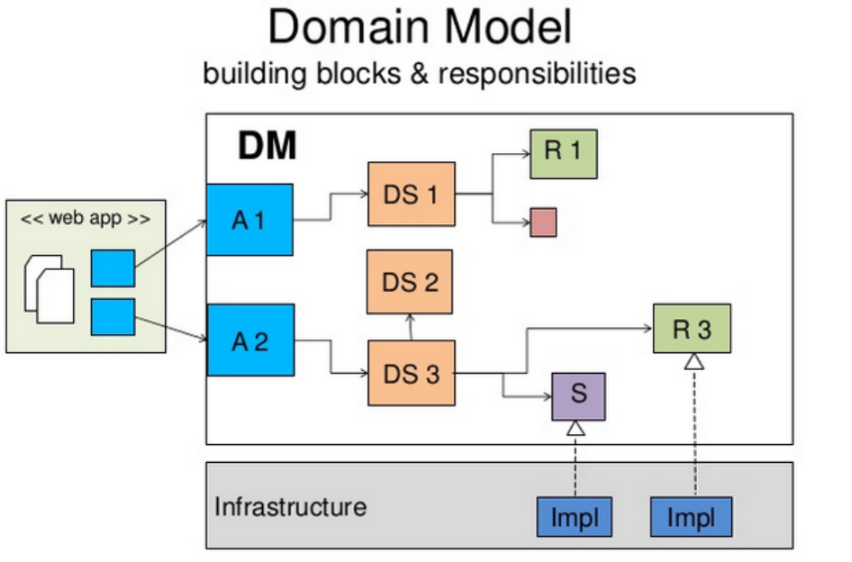

## Briques

### Application service

Représente un use case.
Ne peut pas appeler un autre application service.
C'est le composant frontière donc c'est sur lui que l'on déclare les préocuppations de sécurité, de démarcation transactionnelle... .

Un Application service permet de modifier un seul Agrégat, mais d'agréger les informations de plusieurs Agrégats (au sein d'un DTO).

### Domain service

Encapsule un traitement qui ne tient pas naturellement dans une entité ou un value object.

### Infrastructure service

Un service technique qui ne représente pas forcément un concept métier (pas nécessairement compréhensible par la MOA).
Par exemple, un service d'envoi d'email.

L'interface est dans la couche métier, l'implémentation est dans la couche infrastructure.

A noter que le repository est un infrastructure service spécialisé qui représente une collection.

### Entité

L'id peut être un value object :
- utile pour faire des ID composés
- plus explicite, un int peut être utilisé pour plusieurs entité alors qu'il est clair qu'un entitéAId ne sera utilisé que pour l'entité A

### Repository

Est une collection d'un type d'éléments avec des fonctions de requêtage avancée.
L'interface est dans la couche domaine mais l'implémentation est contenu dans la couche infrastructure. 
N'initie pas la transaction mais participe à la transaction courante.

Attention, Add et Remove sont idempotents : faire 2 add revient à en faire un seul. (TODO A CREUSER)

En lecture, le Repository permet de charger l'Aggregate Root, les autres entités de l'Agrégat ne peuvent être atteintes qu'en suivant les liens d'association.
En écriture, le Repository encapsule la création, la suppression et la modification d'un Agrégat sans exposer les Entités non-racine.

### Factory

Si la création d'un Agrégat est complexe, encapsuler cette création dans une Factory.
Le contrat de la Factory est de produire un Agrégat complètement construit, satisfaisant tous ses invariants.

Nommages possibles :
- BookRepository
- Books
- BookCollection
- Library

## Lien avec MVC

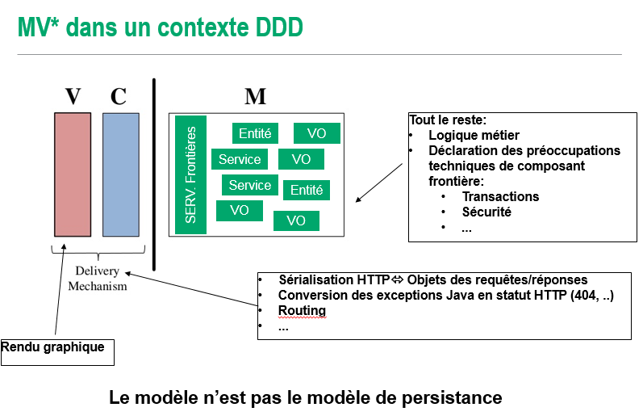

Approche classique :
- M est le modèle de persistance anémique (anti pattern anemic model)
- La logique est dans des controlleurs et services stateless (anti pattern fat controller)
- Le rendu graphique est dans la vue

=> Le plus gros de l'application est dans le C de MVC

Approche DDD :
- M est le modèle métier
- La couche controleur est repsonsable de la serialization des requêtes et réponses, de la conversion des exceptions vers des erreurs HTTP, du routing...
- Le rendu graphique est toujours dans la vue

=> Le plus gros de l'application est dans le M de MVC, le V et le C ne sont que la couche de présentation (Delivery Mechanism)

## Organisation des classes

Plus de détails [ici](http://fr.slideshare.net/sandromancuso/crafted-design-geecon-2014)

Module Core :

- infrastructure : packages parsers, repositories, services...

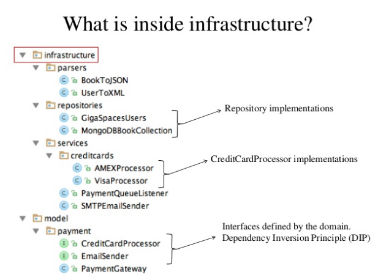 

- model : Modèle domaine, ce dont l'application parle. Regroupé par catégorie de domaine liés entre eux.

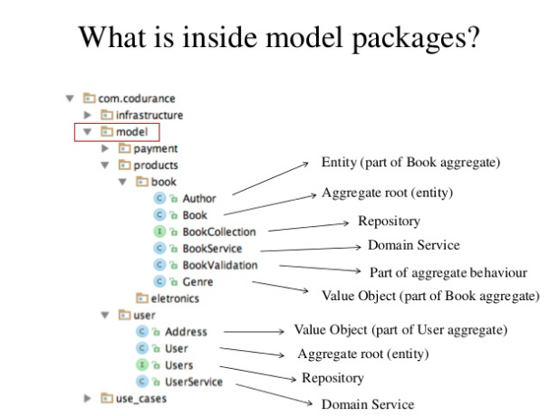 

On va avoir un sous module par aggregat.

- use_cases : cas d'utilisations, ce que l'application fait. Regroupé par theme / epic

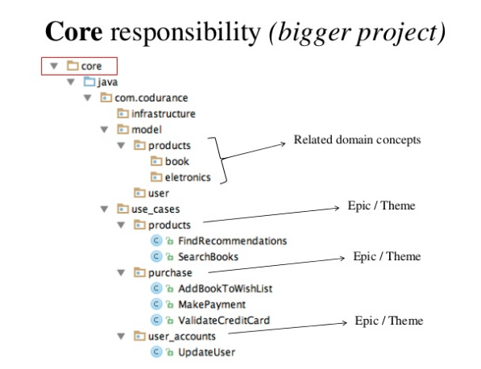 

 
Module Web :

- infrastructure : par exemple parsers XML / JSON
- controllers : flux de contrôle, invoque les uses cases dans le module core
- view : par exemple page objects, validators...
- ../webapp : ressources statiques

## Agregats

### Invariants et transactions

Les aggregats garantissent les invariants.

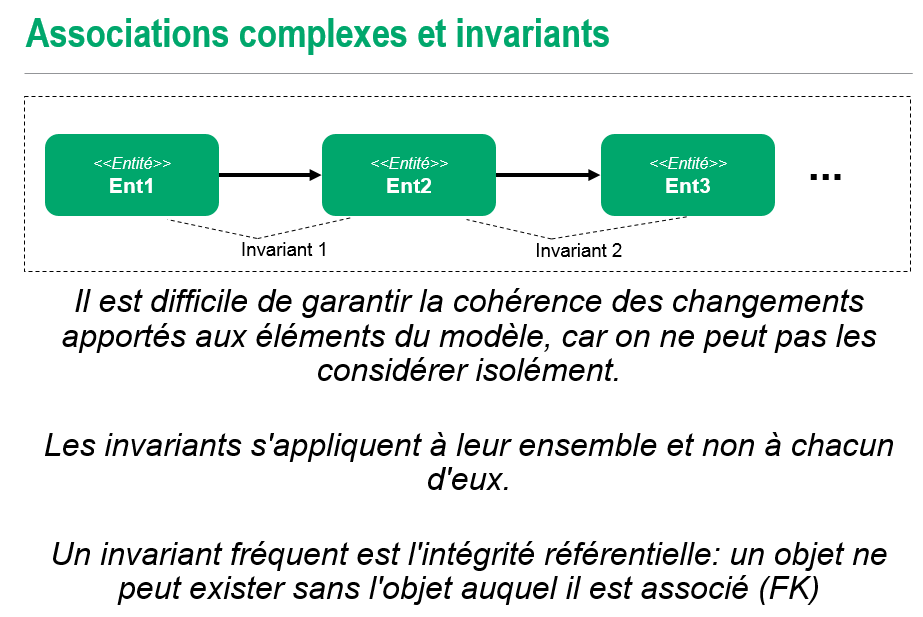

Les frontières des Agrégats sont choisies de façon à permettre la cohérence transactionnelle des invariants.

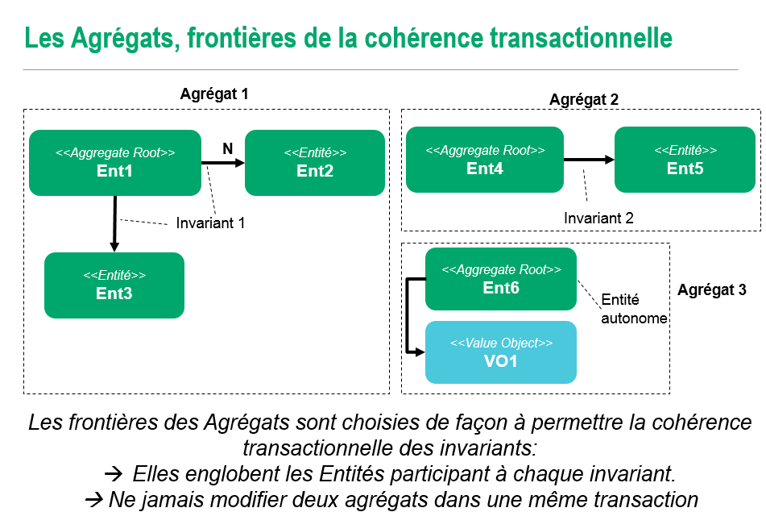

Une transaction ne doit modifier qu'un aggregat ! (risque de deadlock)

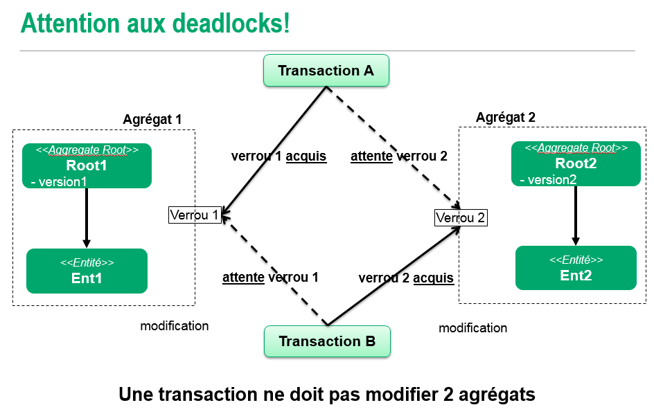

### Granularité

Remplacer une relation directe entre deux aggregat par un value object ID partagé permet de limiter le risque de modification dde deux agrégats dans une même transaction (c'est le principe d'une Foreign Key dans une BDD).
Les relations directes entre agrégats ne sont pas interdites à condition de ne jamais modifier les deux Agrégats dans une même transaction.

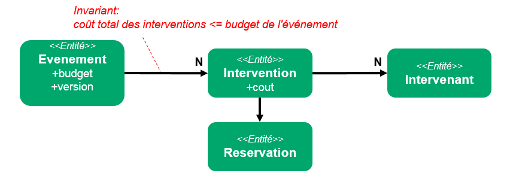

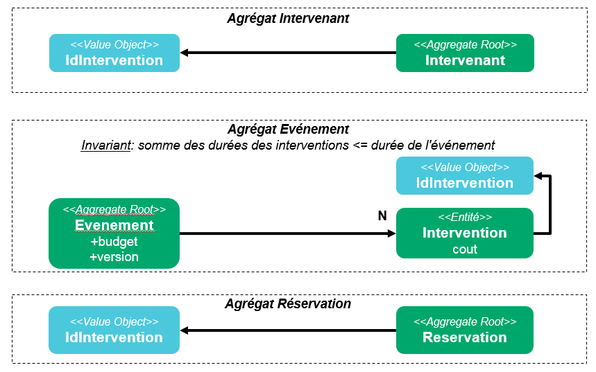

### Aggregate root

Puisque l'Aggregate Root participe à un invariant commun avec les autre Entités de l'Agrégat, le moyen le plus sûr de s'en assurer et de ne permettre de modifier l'Agrégat qu'en passant par l'Aggregate Root.

L'Aggregate Root doit être: 

- Le point d'entrée unique des modifications de l'Agrégat: 
-- Ne pas exporter l'état interne de l'Agrégat pour modification,
-- L'Agreggate Root expose les méthodes nécessaires de modification de l'Agrégat
- Le seul objet de l'Agrégat référencé par des objets extérieurs

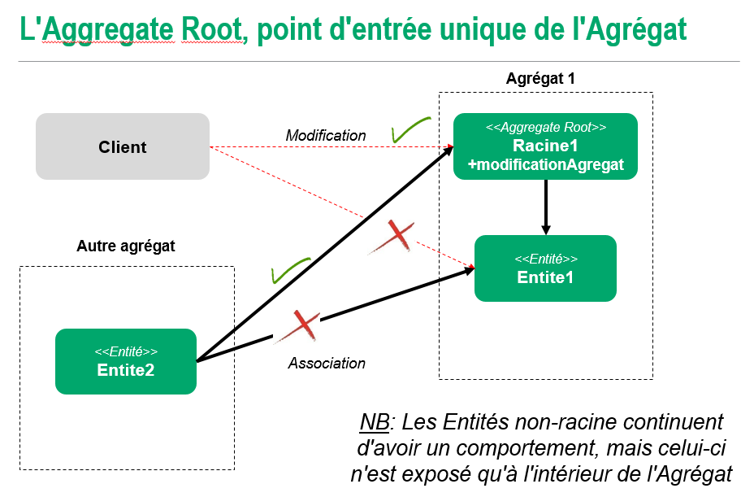

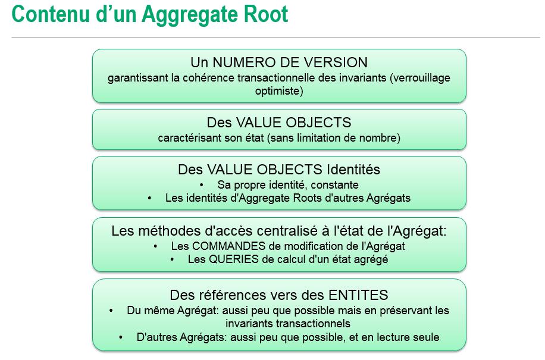

### Visibilité des classes

La visibilité publique par défaut peut entrainer un design complexe et qui ne respecte pas le rôle de point d'accès unique de l'aggregat. 
Pour encourager cela, préferer la visibilité package et ne passer en publique que les classes qui doivent être accessible de l'extérieur (aggregate root et value objects par exemple).

Dans maven, le découpage src/main/java et src/test/java permet de séparer les classes de test du code de production tout en laissant la possibilité de les mettre dans le même package que les classes à tester.

