# Domain Driven Design - Design stratégique

## Bounded context

Lié au métier. Parfois plusieurs par application si plusieurs métiers.

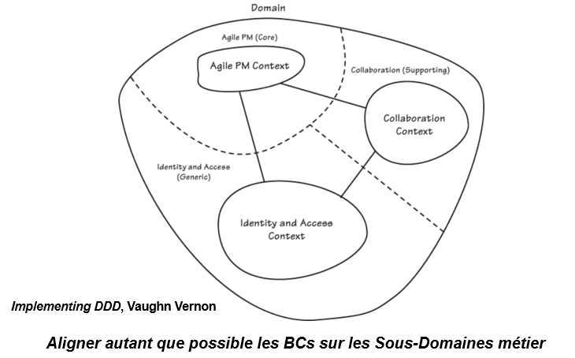

## Context mapping

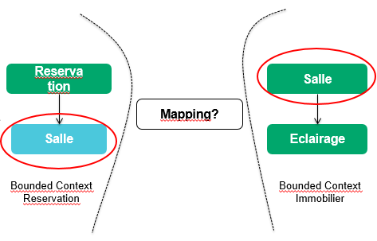
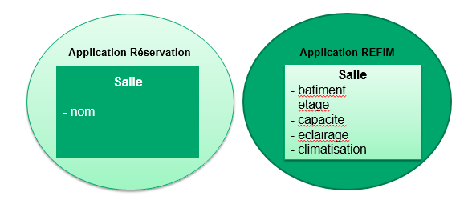

### Communication Upstream / Downstream

Une relation entre deux équipes : L’équipe en amont (upstream) / L’équipe en aval (downstream).

Les actions de l’équipe en amont affecte l’équipe en aval. Mais les actions de l’équipe en aval n’affecte pas les actions de l’équipe en amont.

C’est la métaphore de la rivière : "Si vous êtes en amont et vous polluer la rivière, les personnes en aval vont être impactées. L’inverse n’est pas vrai".

L’enjeu est de donc de spécifier: 
- Comment l'équipe aval va s'adapter à la production de l'équipe amont
- Comment et dans quelle mesure l'équipe amont devra prendre en compte les besoins de l’équipe aval 

## Mapping Patterns

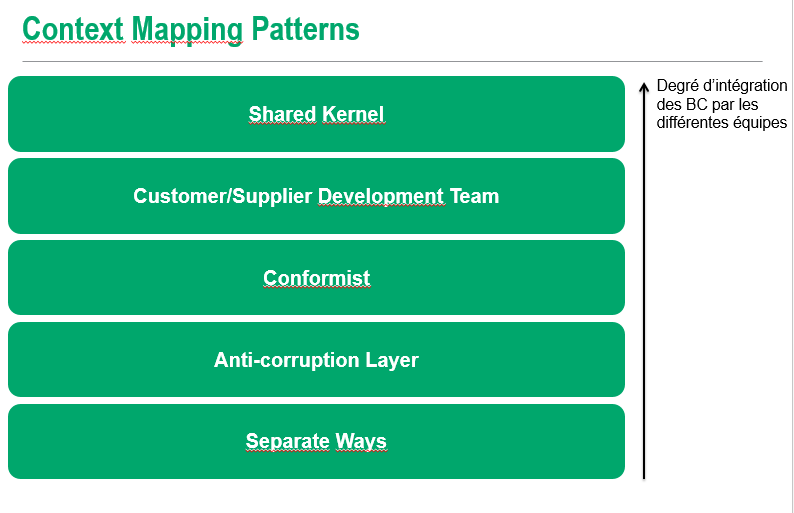

### Shared kernel

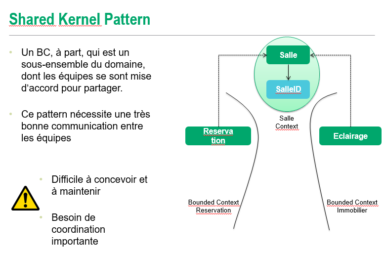

- Les deux équipes (en amont et en aval) se sont mise d’accord sur un sous-domaine du modèle à partager
- Ce modèle commun inclus du code, le modèle de données associé avec la partie du modèle en commun
- La modification de ce modèle commun nécessite la consultation et l’accord des deux équipes simultanément
- En terme d’intégration, dès que le shared model est modifié, on doit rejouer les tests sur les deux autres BC

### Customer / Supplier

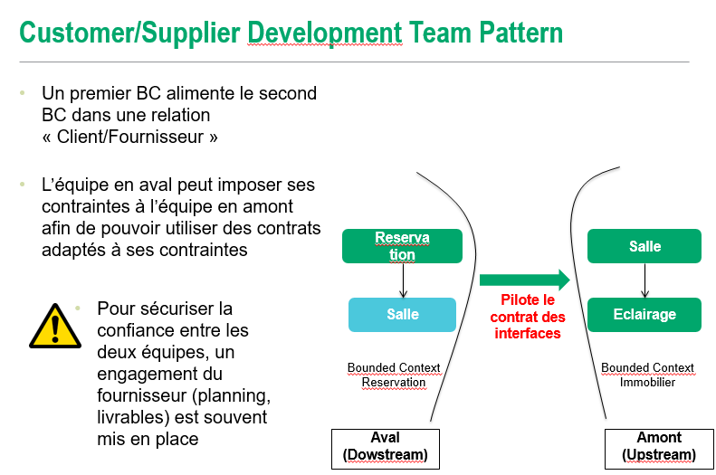

Le Customer/Supplier Pattern correspond au cas où nous avons partitionner notre système en par exemple deux sous-système avec le principe suivant :
- Le système en amont nourrit le système en aval
- Le second système, le système en aval exploite des fonctionnalités du premier système

Les deux sous-systèmes exploitent généralement des fonctionnalités différentes.

### Conformist

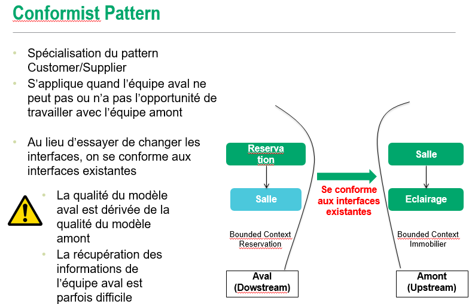

Cela se produit quand l’équipe en amont ne peut pas, ou ne veut pas (n’a aucune motivation pour) de fournir des éléments dans son contrat qu’elle fournit qui va correspondre aux besoins de l’équipe en aval.

L’équipe en aval est impuissante. Elle apprend à continuer à « vivre » avec ce qu’on lui fournit mais dans tous les cas, une interface adapté au besoin de l’équipe en aval n’est pas dans le plan de l’équipe en amont.

En terme de langage, l’équipe aval est amené à partager un langage commun avec l’équipe en amont. 

Ce pattern est présent majoritairement dans nos systèmes d’informations lorsqu’on essaie d’intégrer des progiciels: on subit les termes du langage du progiciel en même temps que son API d’intégration

### Anti-corruption

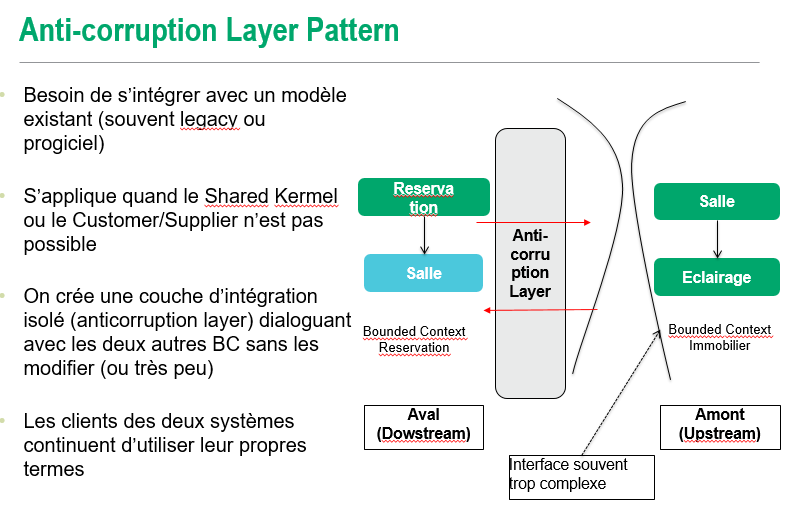

De nouveaux systèmes ont souvent besoin de s’intégrer avec des systèmes dit legacy, disposant de leurs propre modèle.

S’applique quand le Shared Kernel ou le Customer/Kernel n’est pas possible.
L’interface de communication devient alors souvent trop complexe.

On crée une couche d’intégration indépendant qui dialogue avec les interfaces des deux autres modèles.
Pas de modification des interfaces existantes (ou très peu).

### Separate ways

On ne cherche pas à établir une relation à tout prix.
On ne déclare aucune connexion avec les autres BC.

Si les deux contextes divergent trop, on garde les contextes séparés car on considère l’intégration comme coûteuse par rapport aux bénéfices.

# Domain Driven Design - Architecture

## Architecture hexagonale

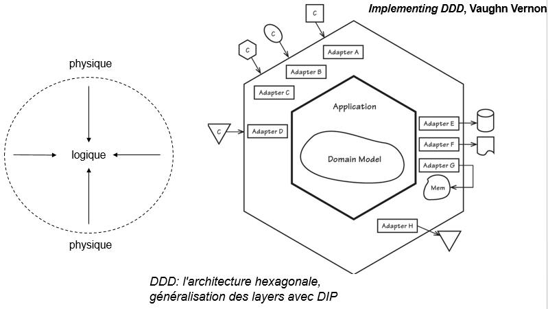

## NoSQL (clé/valeur, colonne ou document, pas graphe)

Les BD orientées agrégat n'implémentent les mises à jour atomiques (ACID) que dans un Agrégat.
Les changements dans deux agrégats sont eux soumis à la cohérence éventuelle.

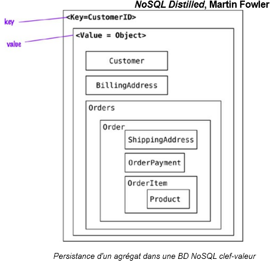

Les BD orientées agrégat permettent toutes de retrouver un Agrégat par l'ID de son Aggregate Root.
L'implémentation du Value Object ID (VOID) est donc cruciale, ces bases étant faites pour être clusterisées.

Le VOID doit donc maintenir sa propriété d'unicité dans un environnement répliqué :
- UUID
- Timestamp+UUID pour lisibilité/requêtabilité

Attention, utiliser une ID générée par la BD NoSQL ne permet pas la stabilité de l'identité!

## Microservice

L'approche DDD est compatible avec une architecture microservices.

Chaque microservice est isolé et autonome, chaque BC est isolé et autonome : Bonne granularité.

Chaque Contexte Borné (Bounded Context) sera déployé dans un microservice.
Cela permet de garantir l'indépendance des BC.

## REST

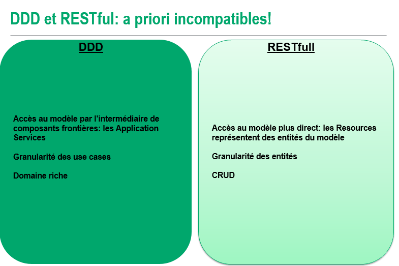

Cependant, une architecture CQRS est compatible avec RESTful:
- on PUT des commandes
- on GET des queries

Dans le cas d’un modèle non CQRS, utilisation de certaines caractéristiques de REST comme levier pour exposer les cas d’utilisation (exprimées par les Application Services) :
- Routing par URIs
- Mécanismes de représentation (content negotiation : https://en.wikipedia.org/wiki/Content_negotiation)

### Annexe - Résumé de REST

Les ressources sont abstraites : On n’accède pas directement à la ressource mais à travers une représentation.  
De nombreuses représentations sont possibles : text/ html; image/jpeg;application/pdf.  

La requête HTTP spécifie la représentation souhaité via l’entête HTTP (Header HTTP) Accept.  
La réponse HTTP spécifie sa représentation via l’entête HTTP Content-Type.  

Le serveur ne maintient aucun état : Pas d’objet session sur le serveur.  
Facilite la scalabité : Chaque instance du serveur peut traiter la requête entrante (on utilise généralement un load balancer).  
C’est le client qui maintient l’état : Hypermedia.  

#### Hypermedia
Les réponses HTTP contient des liens dont on a besoin : Les changement d’état du client sont fait via ces liens (hypermedia).  
On ne connaît pas au préalable comment interagir avec le serveur.

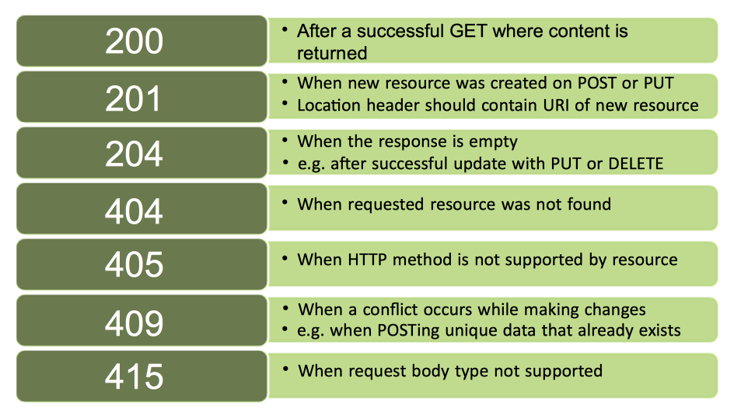

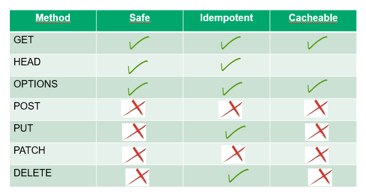

## Styles d'intégration

### Fichier

Simplicité de mise en oeuvre : oui pour des faibles volumes
Couplage : faible
Fiabilité (sécurité, transaction, concurrence) : faible
Temps de latence : élevé
Scalable : non car difficulté d'exploitation

### BDD Partagée

Simplicité de mise en oeuvre : oui 
Couplage : élevé car nécessité d'un schéma commun
Fiabilité (sécurité, transaction, concurrence) : bonne, transactions 
Temps de latence : souvent élevé
Scalable : non car trop lent

### Remote Procedure Call (RPC)

Simplicité de mise en oeuvre : oui 
Couplage : très élevé 
Fiabilité (sécurité, transaction, concurrence) : bonne 
Temps de latence : faible
Scalable : non car le thread d'envoi peut rester bloqué

### Asynchronous Messaging Style

Simplicité de mise en oeuvre : oui 
Couplage : faible
Fiabilité (sécurité, transaction, concurrence) : perte du contexte de transaction et de sécurité, gestion des erreurs plus complexe  
Temps de latence : envoi rapide (fire and forget)
Scalable : oui car faiblement couplé temporellement, physiquement et logiquement

Pour les styles de communication, voir https://www.youtube.com/watch?v=Xwi1DU6KoQ4 et http://www.enterpriseintegrationpatterns.com/.

## Compatibilité entre versions

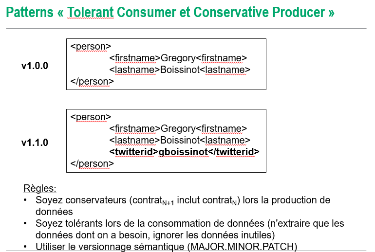

